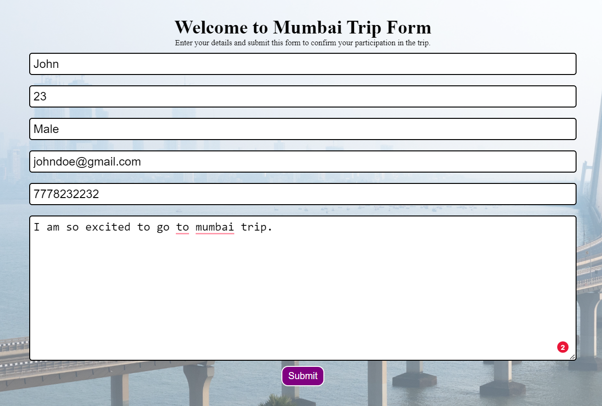
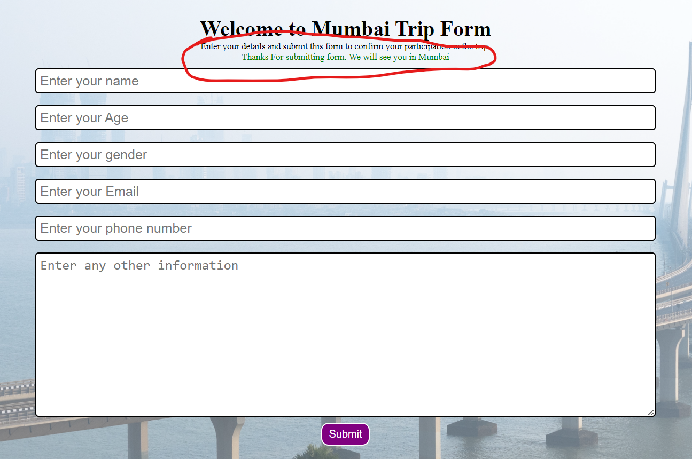
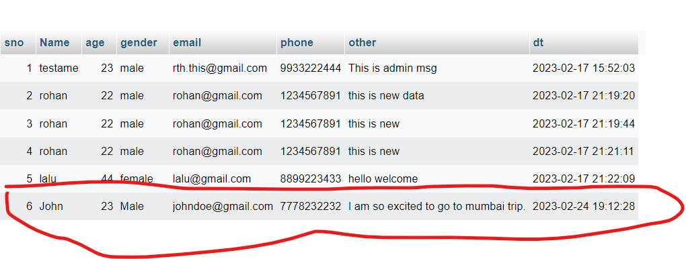

# Mumbai_Travel_form

<h1> This Project is created in PHP, html, css and mysql. </h1>
<h2>The form will take the person Name, Age, Email id, Gender, Phone number and Information who are travelling to Mumbai. 
It will display the message submitted and those details will be added in the database. 
All the details will be added in trip table of mysql database. 
</h2>

<h1>Form With Details Filled</h1> 
 
<h1>After Submitting the message will be displayed.</h1> 
 

<h1>The Details about traveler in Database.</h1> 
 
